# 🎓 King Khalid Training Center — Attendance & Classes

An attendance and classroom system for **King Khalid Training Center**. Staff scan trainee IDs for check-in and check-out, see who is on time, late, absent, or still inside, and teachers file a daily class report. Admins keep the roster, shifts, violations, disciplinary requests, classes, and schedules in one place.

The system replaces paper roll calls and end-of-day class sheets with a scan log and a submitted class report for the same day.

---

## 🔧 Features

### 📊 Today's Summary

- Attendance totals for the current day, in Asia/Riyadh time
- Counts by assigned shift: present, on time, late, and exits
- Date picker to review another day

### 📷 Check-in / Check-out

- Scan a civil or military ID for entry or exit
- Active shift is detected from the clock
- On-time and late status against the shift grace period
- Check-in and check-out logs for the selected day

### 📄 Reports

- Hours, absences, late arrivals, and no-checkout lists
- Search by military ID or name, filter by shift
- Excel and PDF export

### 👥 Trainees, Violations & Discipline

- Trainee roster with rank, specialization, shift, and class
- Bulk Excel import
- Violation records and disciplinary follow-up requests

### 🏫 Classes & Teacher Reports

- Class schedules, class lists, and assigned teachers
- Submitted class reports: present, absent, no checkout, course, and violations
- Teacher view for one class: mark each student and submit the daily report

### 🌍 Multilingual Experience

- English and Arabic UI via `react-i18next`
- RTL / LTR layout with a language toggle on login and in the app shell
- Localized API errors and success messages from the request language

---

## 💡 Impact

- Replaced paper roll call and handwritten class sheets with a scan log and a submitted daily report
- Put shift attendance, absences, late arrivals, and missing check-outs on one screen
- Gave teachers a single class page to mark status and file the report
- Kept ranks, specializations, shifts, and users editable by an admin instead of a fixed spreadsheet

---

## 📦 Tech Stack

| Layer      | Tech                                    |
| ---------- | --------------------------------------- |
| Frontend   | Vite, React 18, TypeScript              |
| i18n       | react-i18next (English / Arabic)        |
| UI         | Tailwind CSS, shadcn/ui                 |
| Backend    | Node.js, Express                        |
| Database   | MongoDB, Mongoose                       |
| Auth       | JWT (httpOnly cookie)                   |
| Deployment | Vercel (FE), Render (BE), MongoDB Atlas |

---

## 🌐 Deployment Notes

- Responsive desktop and mobile layouts
- Demo database on MongoDB Atlas with wipe-and-reseed scripts (`npm run seed:demo:local` / `npm run seed:demo:remote` in `backend`)
- Public demo hosted on Vercel and Render from the `demo` branch; first load after idle may take a few seconds while Render wakes
- Dates and attendance follow the current day in Asia/Riyadh

---

## 🎬 Site Demo

**[▶ Watch site walkthrough](./docs/king-khalid-training-attendance-system-demo.mp4)** (~1¼ min)

Arabic login glance → English admin sign-in → today's summary → check in **2010000003**, then check out → reports (absences, late, no checkout) → trainees → violations → disciplinary requests → class reports → teacher sign-in → mark **Ahmed Mohammed** present, **Khalid Al-Otaibi** absent, **Salem Al-Qurashi** no checkout → submit the class report.

---

## 📸 Screenshots

<table>
  <tr>
    <td width="50%" valign="top">
      <strong>Login</strong> 
      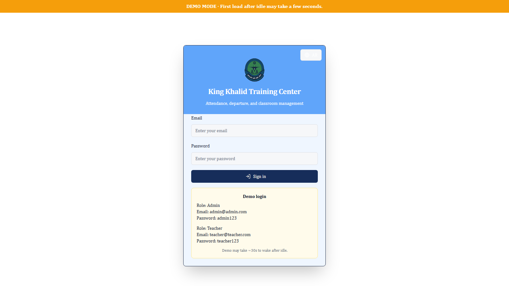
    </td>
    <td width="50%" valign="top">
      <strong>Today's Summary</strong> 
      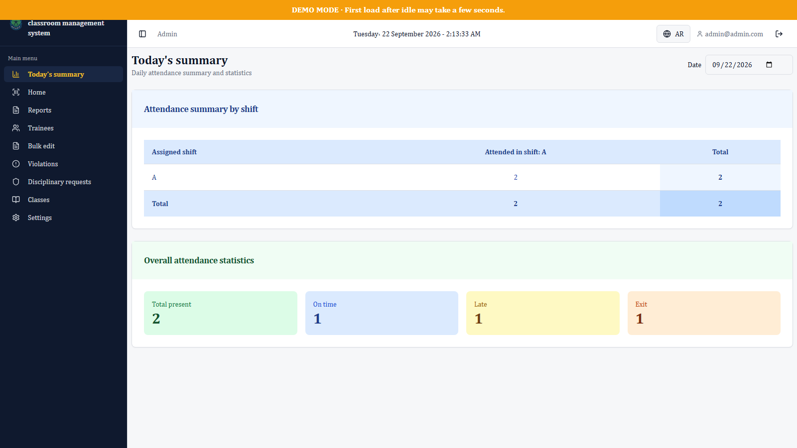
    </td>
  </tr>
  <tr>
    <td width="50%" valign="top">
      <strong>Attendance Scan</strong> 
      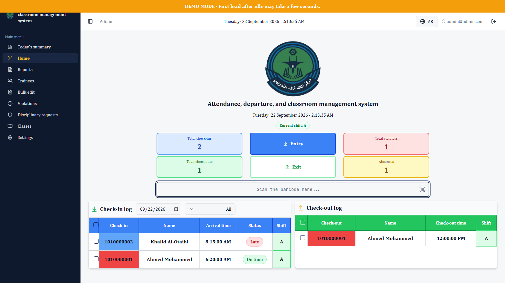
    </td>
    <td width="50%" valign="top">
      <strong>Reports — Absences</strong> 
      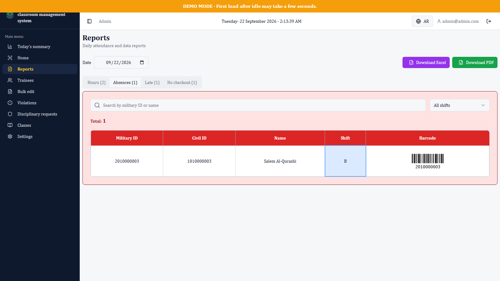
    </td>
  </tr>
  <tr>
    <td width="50%" valign="top">
      <strong>Trainees</strong> 
      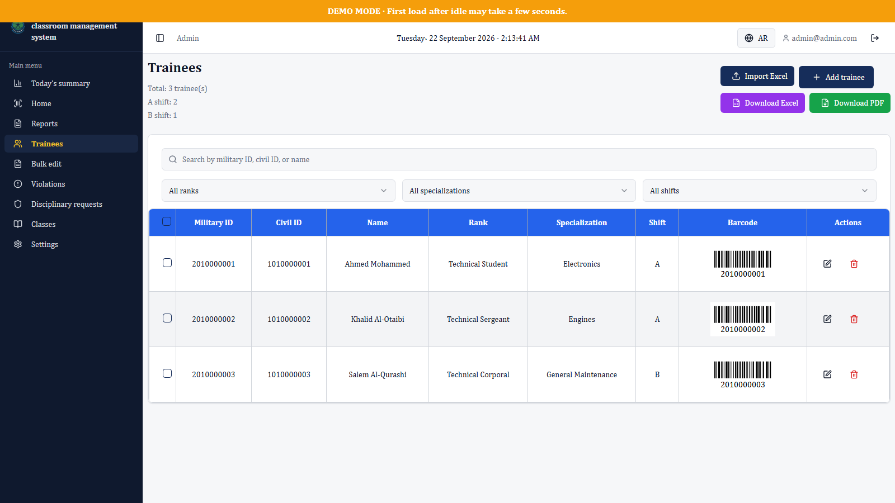
    </td>
    <td width="50%" valign="top">
      <strong>Violations</strong> 
      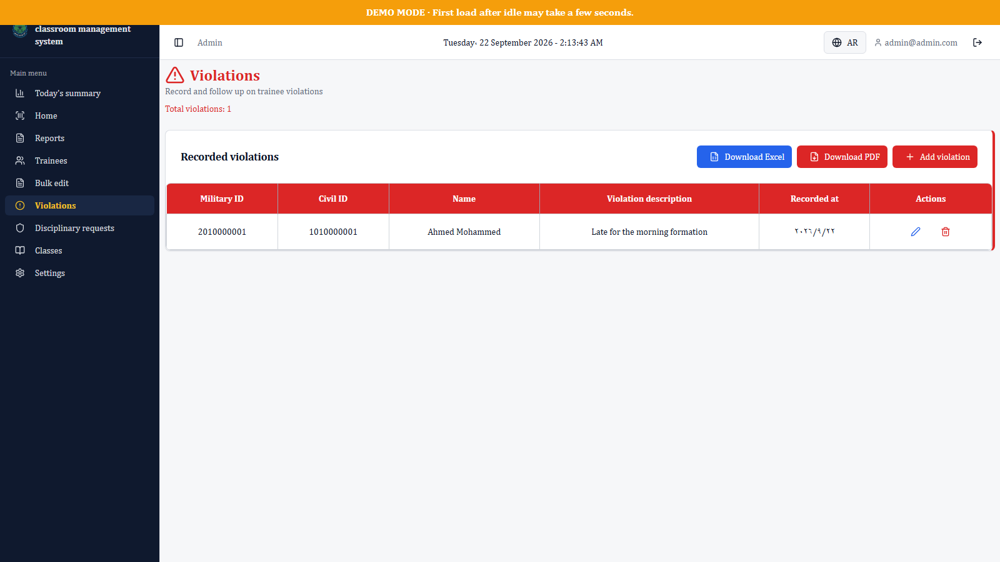
    </td>
  </tr>
  <tr>
    <td width="50%" valign="top">
      <strong>Disciplinary Requests</strong> 
      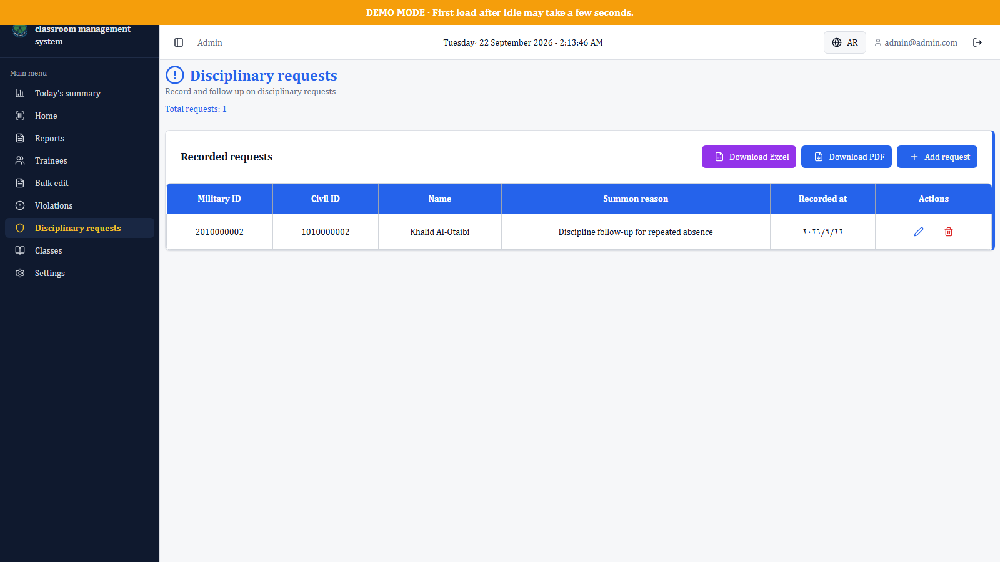
    </td>
    <td width="50%" valign="top">
      <strong>Class Reports</strong> 
      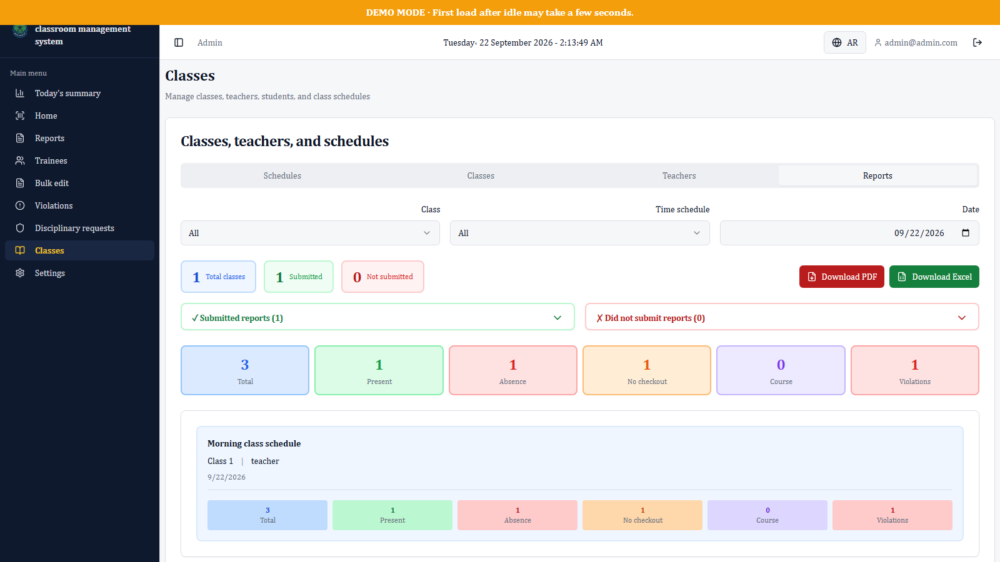
    </td>
  </tr>
  <tr>
    <td width="50%" valign="top">
      <strong>Teacher Class Report</strong> 
      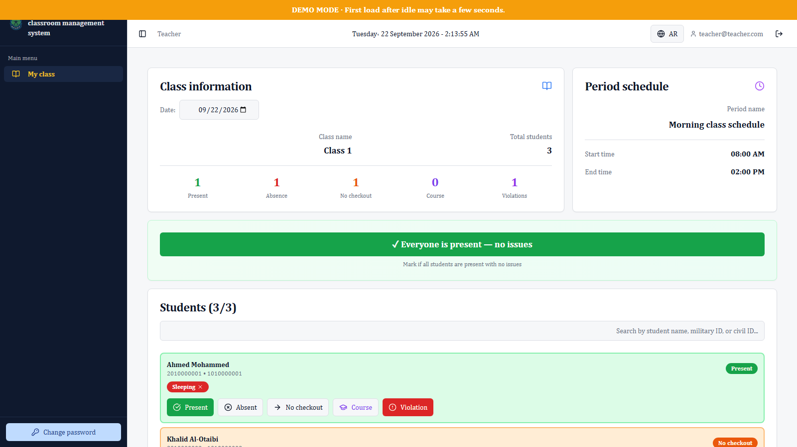
    </td>
    <td width="50%" valign="top">
      <strong>Arabic Login</strong> 
      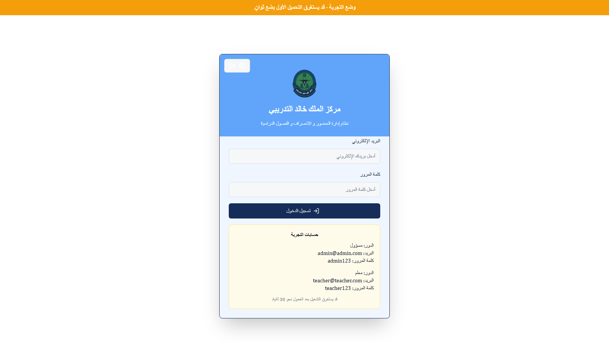
    </td>
  </tr>
  <tr>
    <td colspan="2" valign="top">
      <strong>Mobile Login</strong> 
      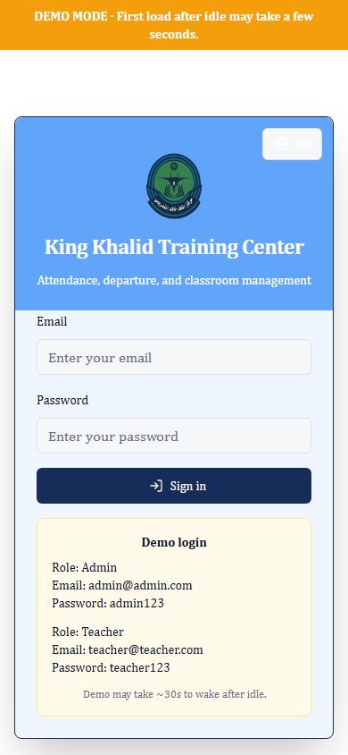
    </td>
  </tr>
</table>

---

## Live Demo 🚀

[**View Live Demo**](https://king-khalid-training-attendance-system-demo.vercel.app)

| Role    | Email               | Password   |
| ------- | ------------------- | ---------- |
| Admin   | admin@admin.com     | admin123   |
| Teacher | teacher@teacher.com | teacher123 |

---

## Author

👤 **Omar Mahmoud**
📧 [omrmhd54@gmail.com](mailto:omrmhd54@gmail.com)
💼 [LinkedIn](https://www.linkedin.com/in/omrmhd5/)
🌐 [Portfolio](https://omarmahmoud.dev/)
🔗 [GitHub](https://github.com/omrmhd5)
